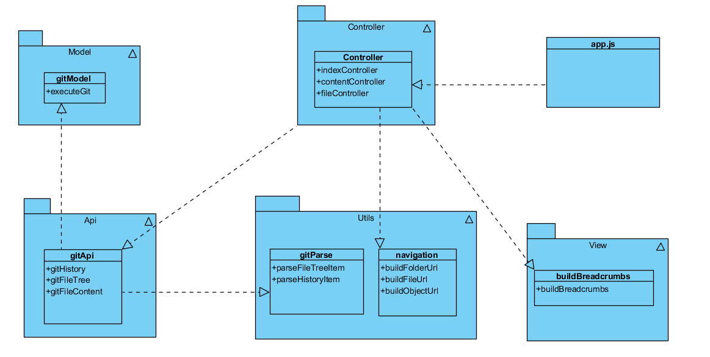

## Модульные тесты

Система разделена на логические блоки подобным образом


Такое разделение увеличивает связность каждого модуля и позволяет упростить добавление точек расширения. В данном случае довольно просто использовать наследование 
как точки расширения каждой функции для использования заглушек в модульных тестах.

# Как запустить

```
npm i
npm run test
```
Все тесты находятся в папке tests

## Интеграционные тесты

Для интеграционных тестов был использован selenium и плагин hermione

# Как запустить

- установить selenium-standalone

В 3 разных выполнить по команде:
```
selenium-standalone start
npm start
npm run hermione
```

Все тесты находятся в папке hermione
