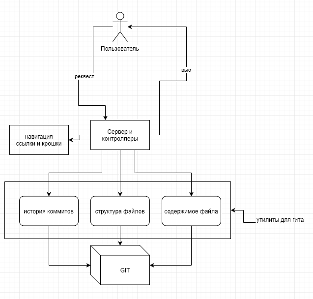

# Домашнее задание: автотесты

Вам дано приложение на JavaScript и нужно написать для него автотесты: интеграционные тесты на интерфейс и модульные тесты на серверную часть.

## Предметная область

Приложение отображает в браузере информацию из git репозитория: список коммитов, файловую систему для выбранного коммита, содержимое выбранного файла (поддерживаются только текстовые форматы). Для удобства навигации на каджой странице отображаются "хлебные крошки".

## Как запустить

```sh
git clone git@github.com:dima117/shri-testing-homework.git
cd shri-testing-homework.git
npm i
npm start
```

## Интеграционные тесты

Сценарии для интеграционных тестов

- на всех страницах (история коммитов, просмотр файловой системы, просмотр содержимого файла) правильно отображается их содержимое;
- правильно работают переходы по страницам
  - из списка коммитов на список файлов
  - из списка файлов во вложенную папку
  - из списка файлов на страницу отдельного файла
  - переходы по хлебным крошкам

## Модульные тесты

- нужно добавить в README список логических блоков системы и их сценариев
- для каждого блока нужно написать модульные тесты
- если необходимо, выполните рефакторинг, чтобы реорганизовать логические блоки или добавить точки расширения

---

## Логические блоки системы



1. Сервер и контроллеры - входная точка приложения отвечающая за связь с пользователем

2. Навигация - его вызывают контроллеры для формирования ссылок, по которым пользователь доходит до нужной ему инфы из гита

3. Утилиты для работы с гитом - блок с 3-мя подблоками. Их тоже вызывают контроллеры. Они получают данные из гита, парсят и возвращают их контроллерам
    1. история коммитов
    2. структура файлов
    3. содержимое файла

## Сценарии

1. Серв и Ко
   1) При обращении пользователя по роуту **/** → ожидается вызов `indexController`
   2) Аналогично по роуту **/files** → вызов `filesController`
   3) По роуту **/content** → вызов `contentController`
   4) *Неизвестный роут* → ошибка

2. Навигация 
	1) Публичный метод `buildBreadcrumbs` возвращает правильные крошки с разными параметрами
	2) `buildObjectUrl` возвращает правильные ссылки с разными параметрами

3. Утилиты гита 
	1) `gitHistory` вызывает гит с правильными аргументами + возвращает правильно распарсенный ответ
	2) Аналогично с `gitFileTree`
	3) Аналогично с `gitFileContent`

---

## Инструкции

```
git clone https://github.com/smakhl/shri-testing-homework.git
cd shri-testing-homework
npm i
```

### Запуск модульных тестов
```
npm run test:unit
```

### Запуск интеграционных тестов

Подготовка
- Клонируем тестовый репозиторий
```
git clone https://github.com/smakhl/test-repo.git
```
- копируем его путь в переменную `REPO_PATH` в файле **shri-testing-homework/tests/integrationTestStart.js**

```sh
npm i selenium-standalone --global
selenium-standalone start

# в отдельном терминале

npm run test:integration
```

## Рефакторинг 
1. В модуле утилит гита добавил публичный метод `injectGitExec`, с помощью которого можно замокать приватный метод `execFile`, который отвечает за вызов cli гита. Это дало возможность тестировать, что он вызывается с правильными аргументами, и что его ответ затем правильно парсится.
2. В модуль навигации занёс метод `buildObjectUrl`, который почему-то лежал в контроллере. Этот один публичный метод заменяет два других, что немного упростило тестирование.
3. В модуле гита добавил возможность передать в переменной окружения путь к тестовому репозиторию для интеграционных тестов. 
